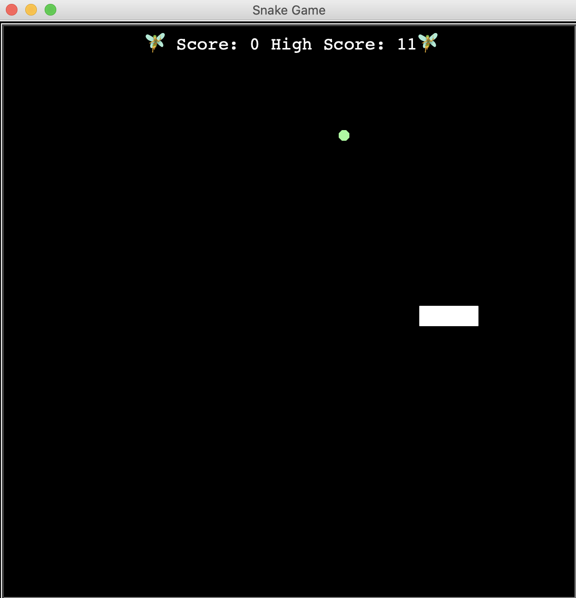

# Snake

simple snake in python

User's higher score save and updated within data.txt

## Controls

User arrow keys to move around

## Bug to work on one day:

- sometimes current score doesn't update when user lose
- sometimes "score text" doesn't clear and overlapses itself 

